# KW功能块简明开发手册


## 1. 环境要求

- KW Multiprog Express 5.35
- ARM\_LE\_GCC3\_eCLR\_3.0.20731.exe
- Visual Studio 2010

## 2. 安装软件

1. 安装Visual Studio 2010

2. 安装KW Express 5.35版

3. 安装KW ProConOS eCLR插件，安装步骤中确保选中“Install Visual Studio/Visual C# Express Support”，如下图。这样安装完成后，系统环境变量中会添加ECLRTOOLS变量，该变量值为KW固件编译工具的路径。在64位Win7上默认为“C:\Program Files (x86)\Common Files\KW-Software Shared\Tools\”

	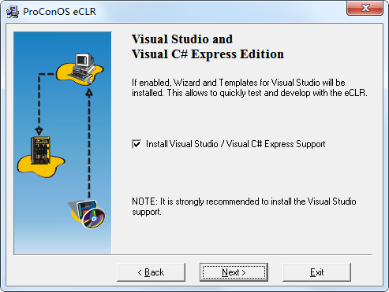

## 3. 功能块实现（C#）

本示例展示使用C#编写一个功能块的方法

1. 新建工程，选择Visual C#下的 `eCLR` 分类中的 `eCLR Firmware Library`

	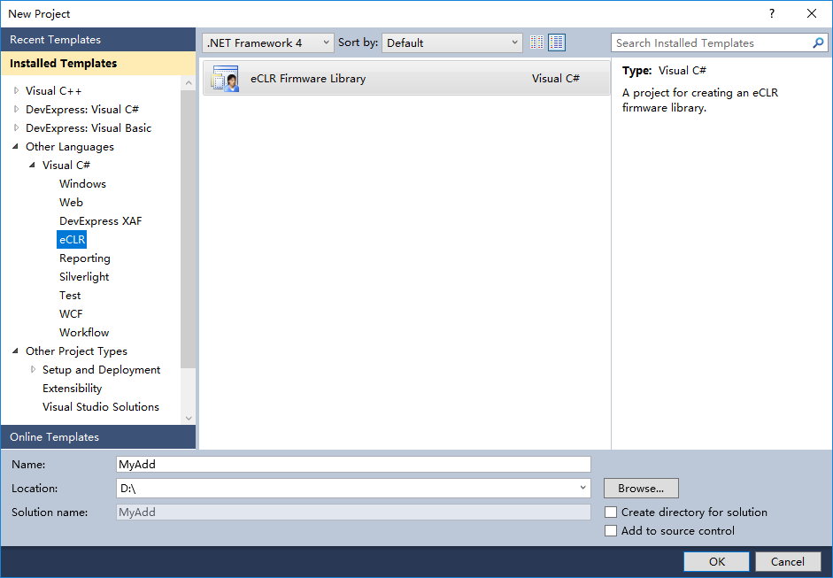

2. 新建的工程中的 `References` 里有两个lib文件，如下图，默认工程模板加入的状态是不对的，需要先Remove掉

	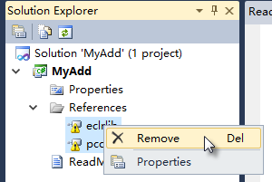

3. 然后再在 `References` 上点击右键菜单中的 `Add Reference...`，在弹出的对话框中选择 `Browse` 标签页，在文件名中输入 %ECLRTOOLS% 后回车，然后依次进入eCLR，FWLibBuilder目录，选择该目录下的 *eclrlib.dll* 和 *pcoslib.dll* 两个文件，将它们添加到 `References` 中。

	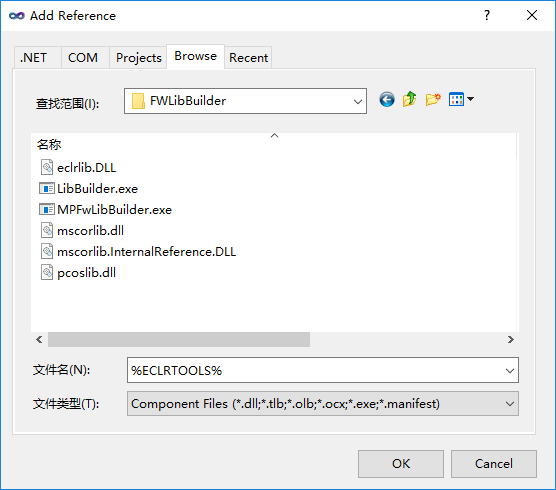

4. 添加后的结果如下图所示

	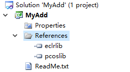

5. 修改工程属性，在 `Build Events` 中找到 `Post-build event command line` ，将原本的 LibBuilder.exe 的路径修正，如下图所示。

	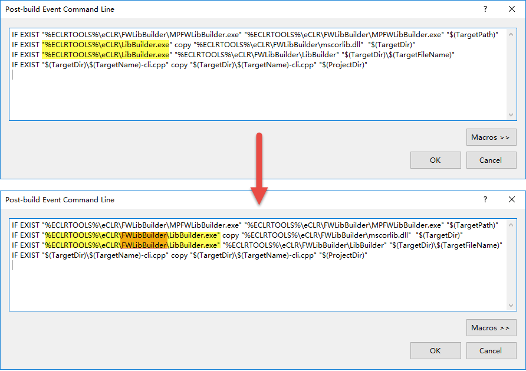
	
6. 环境准备好之后，在菜单栏上的 `Project` 菜单中，点击 `Add Class...` 菜单项 
 
	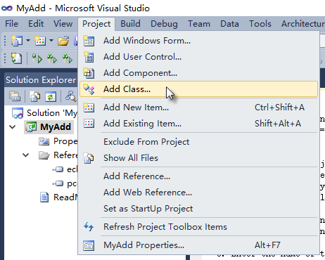

7. 在 `Add New Item` 对话框中选择 `eCLR` 分类下的 `eCLR Firmware Function Block` ，在 `Name` 栏位填入Add_3。

	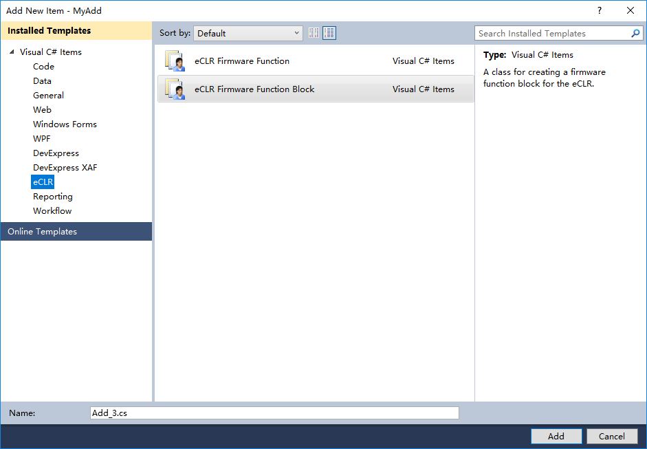

8. 修改新建的Add_3.cs文件，添加三个输入变量和一个输出变量，并在 `__Process` 方法中完成功能块逻辑，如下所示。

	```csharp
	using System;
	using System.Iec61131Lib;
	using Eclr;
	
	namespace MyAdd
	{
	    [FUNCTION_BLOCK]
	    public class Add_3
	    {
	        [VAR_INPUT("REAL")] public Single           IN1 = 0;
	        [VAR_INPUT("REAL")] public Single           IN2 = 0;
	        [VAR_INPUT("REAL")] public Single           IN3 = 0;
	
	        [VAR_OUTPUT("REAL")] public Single          OUT = 0;
	
	        public Add_3()
	        {
	        }
	
	        public void __Init()
	        {
	        }
	
	        public void __Process()
	        {
	            OUT = IN1 + IN2 + IN3;
	        }
	    }
	}
	```

9. 如果选择Debug版本编译，会在bin\Debug目录下生成一个MyAdd目录，里面有以下5个文件，如下图所示。
其中的MyAdd.PDB文件是调试符号表文件可以删除不用，其他文件都是必须的，制作安装包的时候都要包含进去。
 
	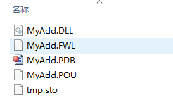

## 4. 功能块的使用

1. 打开 `MULTIPROG Express` ，新建工程，其中的过程基本上就是按照向导一步一步来，在此不再赘述。
需要注意的是，如果需要用模拟器来进行模拟测试，则在其中的资源选择那一页，应将类型选择为 `eCLR\_Simulation` ，如下图所示。

	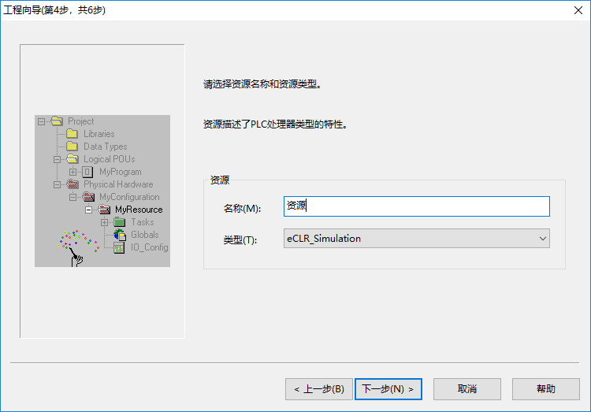

2. 在工程页面，右键点击工程树的 `库` 节点， 选择 `插入` -> `固件库` 。

	

3. 定位到C#工程编译输出目录，本例是 `D:\MyAdd\bin\Debug\MyAdd` ，选择其中的 `MyAdd.FWL` 。

	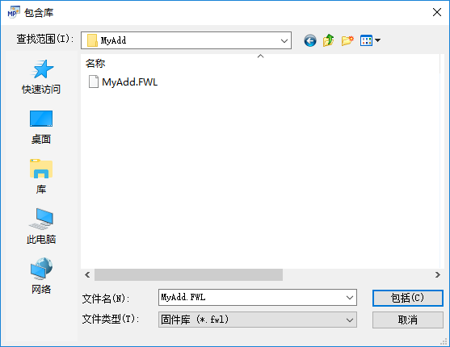
 
4. 固件库添加完毕后，在右边的编辑向导中的组列表可以看到 `MyAdd` 库，其中有个功能块 `Add_3` ，将其拉出到功能块代码页，配置好输入输出变量，即可制作及调试。

	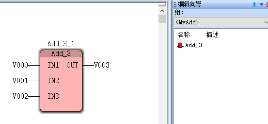

## 5. 功能块实现（Native）

开发Native功能块的方式的工程创建方式与开发C#功能块相同，请参考第3部分。

1. 工程创建后，添加功能块class的方式也与C#功能块相同，不同的地方在于，添加完成后，需要为class添加 `[Native]` 属性，并且不要实现任何接口函数（将会在C++代码中实现），如下所示，跟之前的示例代码相比，`[FUNCTION_BLOCK]` 下多了 `[Native]` 一行，表明这是Native的功能块。

	```csharp
	using System;
	using System.Iec61131Lib;
	using Eclr;

	namespace MyAdd
	{
		[FUNCTION_BLOCK]
		[Native]
		public class Add_3
		{
			[VAR_INPUT("REAL")] public Single           IN1 = 0;
			[VAR_INPUT("REAL")] public Single           IN2 = 0;
			[VAR_INPUT("REAL")] public Single           IN3 = 0;

			[VAR_OUTPUT("REAL")] public Single          OUT = 0;

			public Add_3()
			{
			}

			public void __Init()
			{
			}

			public void __Process()
			{
			}
		}
	}
	```

2. 添加完 `[Native]` 属性后，就可以编译了，编译成功后，会在 bin\Debug 目录下生成三个用于 C++ 工程的文件：MyAdd-cli.cpp，MyAdd-template.cpp，MyAdd-template.h。

3. 将这三个文件，复制到C++工程目录中，假设在D:\MyAdd\arm\目录，并将 MyAdd-template.cpp 和 MyAdd-template.h 的文件名中的 `-template` 去掉，改为 MyAdd.cpp 和 MyAdd.h。

4. 在C++工程目录中新建文件 `Module.h`，内容如下
	```c++
	#ifndef INCLUDE_MODULE_H_
	#define INCLUDE_MODULE_H_

	#include "controller.h"

	#ifdef __cplusplus
	extern "C" {
	#endif /* __cplusplus */

		typedef unsigned (*ECLR_ADD_NATIVE_LIB) (
			void * pMeta,
			unsigned size,
			LibCompat pCompat,
			LibLoadUnload pLoad,
			LibLoadUnload pUnload );

		typedef bool (*EM_INIT) ();
		typedef bool (*EM_LOADLIBRARY) ( ECLR_ADD_NATIVE_LIB addNativeLib );

	#ifdef __cplusplus
	}
	#endif /* __cplusplus */

	#endif /* INCLUDE_MODULE_H_ */
	```

5. 在C++工程目录中新建文件 `Module.cpp`，内容如下
	```c++
	#include "eclr.h"
	#include "MyAdd.h"
	#include "Module.h"
	
	ECLR_ADD_NATIVE_LIB g_addNativeLib = NULL;
	
	extern "C" bool EM_Init ()
	{
		return MyAdd::init();
	}

	extern "C" bool EM_LoadLibrary ( ECLR_ADD_NATIVE_LIB addNativeLib )
	{
		g_addNativeLib = addNativeLib;
		return MyAdd::loadLibrary();
	}
	```

6. 在C++工程目录中新建文件 `Makefile`，内容如下
	```Makefile
	CC=arm-linux-gnueabihf-g++
	CFLAGS=-Ieclrlib
	DEPS = Module.h MyAdd.h
	OBJ = Module.o MyAdd.o MyAdd-cli.o

	%.o: %.cpp $(DEPS)
		$(CC) -c -fPIC -shared -o $@ $< $(CFLAGS)

	eclr_MyAdd.so: $(patsubst %.o,%.cpp,$(OBJ))
		$(CC) -fPIC -shared -o $@ $^ $(CFLAGS)
	```

7. 编辑 MyAdd-cli.cpp.

	* 添加两行代码到 `#include "MyAdd.h"` 下面，如下所示

	```csharp
	#include "MyAdd.h"
	#include "Module.h"
	extern ECLR_ADD_NATIVE_LIB g_addNativeLib;
	```

	* 修改 `MyAdd::loadLibrary` 中的 `addNativeLib` 为如下内容
	
	```csharp
	s_modulHndl = g_addNativeLib(MyAdd_meta, size, isCompatible, load, unload);
	```

8. 复制 `eclrlib` 目录到C++工程目录中

9. 执行make，即可得到 `eclr_MyAdd.so` 文件，将该文件复制到设备上的 `/home/sysuser/bin` 目录，重启eclr程序，即可使用。


